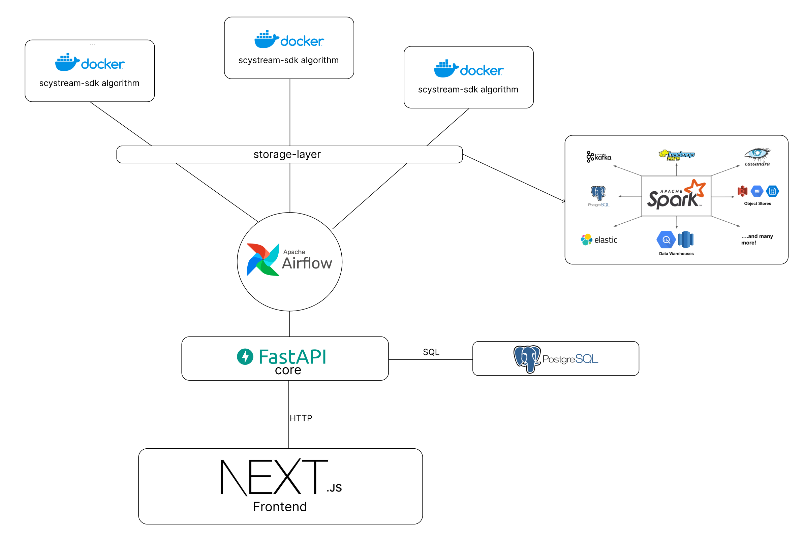

The scystream project is an open-source data-science pipeline toolkit containing all necessary tools to create and carry our data-science workflows.
With an easy to use frontend, you can schedule and deploy custom workflows containing different data processing tasks.

## Architecture



## quickstart

Its recommended to use [docker](https://docs.docker.com/get-docker/) and [docker-compose](https://docs.docker.com/compose/install/)

### Docker

To setup all services just run the following command in the root directory

```sh
docker compose up -d
```

#### Using Protected Git Repositories and Docker Registries

If your compute blocks depend on private Git repositories or Docker images, ensure proper authentication is in place.

#### Git Repositories

Make sure that the user executing `docker compose up` has ssh access to the required git-repos.
We are mounting the hosts ssh-agent to the core container.

#### Docker Registries

For private Docker registries (e.g., GitLab):

1. Run `docker login registry.gitlab.com` to create the `~/.docker/config.json`.

We are mounting the `.docker` directory to the airflow containers.

## Development

You can find the development READMEs in the according directories

