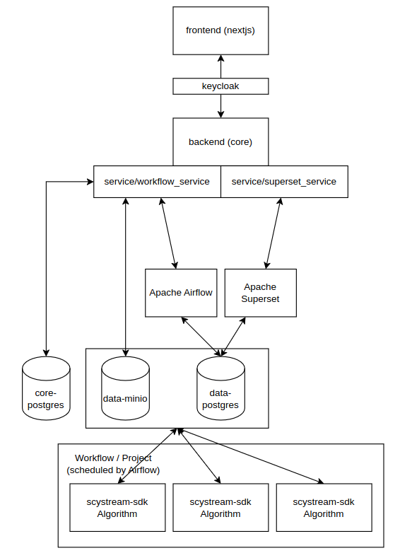

# Scystream

The Scystream project is an open-source data-science pipeline toolkit containing all necessary tools to create and execute data-science workflows.

Using an easy-to-use frontend, users can schedule and deploy custom workflows consisting of different data-processing tasks.

## Architecture



### Short Description

The frontend is a Next.js application that communicates with the backend (“core”) via HTTP. Authentication and authorization are handled through Keycloak.

The backend is built with FastAPI and consists of two primary services:

#### Workflow Service

Responsible for all workflow-related logic, including:

- project creation and management
- adding and configuring compute blocks
- starting and stopping workflows
- workflow orchestration

The workflow service integrates with Apache Airflow, which is responsible for scheduling and executing compute blocks.

#### Superset Service

Handles integration with Apache Superset, including:

- dashboard configuration
- linking dashboards to workflows and projects

After every successful run, all tables the workflow wrote are available as
Superset datasets and shown on the project dashboard. The dashboard is built
from an uploaded visualization template (a Superset dashboard export) or, if
there is none, a standard dashboard. The project page links to it and shares
it with the logged-in user. Cloning a project also clones its visualization.
Superset itself is built from [`superset/`](superset/README.md), which
documents the setup, including Superset hosted elsewhere.

Compute blocks are implemented using the [scystream-sdk](https://github.com/RWTH-TIME/scystream-sdk).

Each compute block is packaged as a Docker container and includes a `cbc.yaml` file that defines:

- configuration options
- expected inputs
- produced outputs

Workflows can be described declaratively using the project's Template Schema (see the corresponding template repository on GitLab for more details).

The system uses three primary data sources:

#### core-postgres

Stores all application-related metadata and state required by the core platform.

#### data-postgres

Stores structured workflow and compute data processed by compute blocks.

#### data-minio

Object storage used for files and larger datasets accessed by compute blocks.

Compute blocks can read from and write to both `data-postgres` and `data-minio` during execution.

## Quickstart

It is recommended to use [Docker](https://docs.docker.com/get-docker/) and [Docker Compose](https://docs.docker.com/compose/install/).

### Docker

To start all services, run the following command in the project root directory:

```sh
docker compose -f docker-compose.dev.yml up -d
```

You might be required to setup the keycloak environment correctly.

For development, run the frontend and backend locally:

```sh
npm run dev
```

```sh
uvicorn main:app --reload
```

Please make sure to configure the front- & backend correctly using corresponding `.env` files for them.

#### Working with Compute Blocks

Compute Blocks, when pulled initially, are stored within `core/repos/`. For development purposes, when changes are made to
compute blocks, you should also pull these changes into your `core/repos/` directory (Dont forget to update the image, using the correct tag (e.g. `pr-14`).

The Airflow Container uses the docker-images downloaded to your own device. Make sure to keep them up to date accordingly.

## Continuous Integration

| Workflow     | What it checks                                                                                                                                              |
| ------------ | ----------------------------------------------------------------------------------------------------------------------------------------------------------- |
| `CI`         | Lints frontend, core and the workflow files, runs the core unit tests, validates the compose files and builds the frontend, core and superset images      |
| `Migrations` | Runs the alembic migrations up and down and checks that the models match them                                                                              |
| `Airflow`    | Checks that the Airflow image and `apache-airflow-client` versions match, loads DAGs rendered by core in the Airflow image and runs the workflow lifecycle (register, trigger, status, delete) against a real Airflow |
| `Superset`   | Unit tests the Keycloak token validation and runs the project visualization end to end against a real Superset: data sync, standard dashboard, sharing, template export, clone and uploaded templates |

Run the core unit tests locally with:

```sh
cd core
pip install -r requirements-dev.txt
pytest
```
